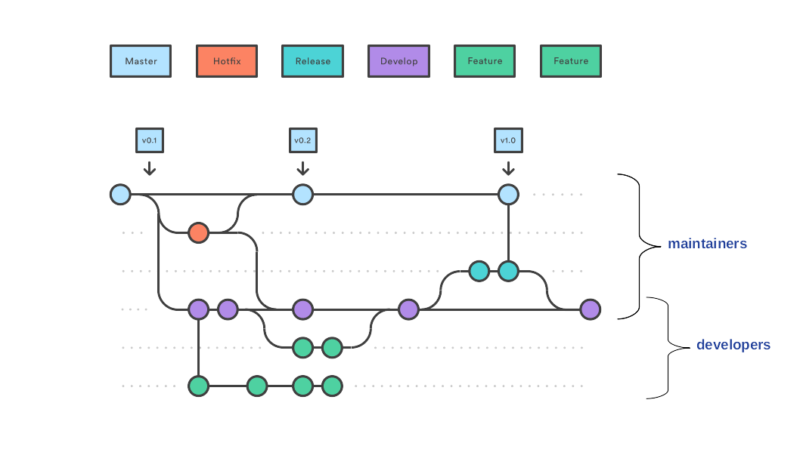

# Git Workflow
----------------------------------------
After you have decided which repository to fork from (link to Getting started/Project organization) you will want to create your own local repository.

### Git basics

* Local repository is entirely independent of the remote. All developers should work from their own forks, which allow them to track remote branches providing data security as well as the ability to work between multiple local repositories.

#### Instructions on forking (fixpix)

To create a fork, navigate to the repository you will most directly be working with. For the Grigorieff lab, this is [Ben's fork](https://github.com/bHimes/cisTEM_downstream_bah) 

Just click on the fork button on the top right


#### Cloning your new remote fork to work locally

```bash
$ git clone https://github.com/YOUR-USERNAME/Your-repo
```

```{note} Your-repo in the current example is cisTEM_downstream_bah.The full URL can be copied from the green "code" box on your github page.
```

#### Getting to work!

* You will not work on the master or development branches directly. For each feature, you will create a feature branch off of the development branch, and do some work there.

```bash
$ git checkout development # ensure the ancestor of your feature is infact the development branch
$ git checkout -b my_new_feature # create the new branch and switch to it in one step
$ git branch # confirm you are on you new branch and not accidently in a detached HEAD state
```

```{hint} **Saving, and reverting changes in your local repo**
If you are not familiar with CLI git, please read through the sections "Saving changes, Inspecting a repository and Undoing changes" in this very nice [tutorial by Atlassian.](https://www.atlassian.com/git/tutorials/undoing-changes)
```


#### Sharing your work

After you ensure the changes in your feature branch:
- Compile
- Do what they are supposed to without breaking anything else
- Do not introduce spurious comments, white-spaces or deletions

The next step is to clean up your local commit history:

**TODO add rebase info

**TODO add pull request info.

#### The repository workflow overall (handled by maintainers.)





